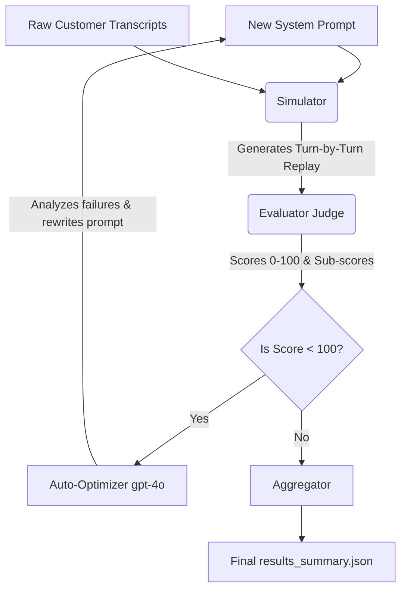

# Riverline Prompt Engineer Assignment

**Role:** Prompt Engineering Intern @ Riverline  
**Tools:** Python 3.9, OpenAI API (`gpt-4o-mini`, `gpt-4o`)

---

## 🎯 Interview Q&A

**Did you find the real issues?** 
Yes. I identified three catastrophic root causes in the original prompt:
1. **No Language-Switch Fallback:** The agent would loop helplessly in English if the customer spoke Hindi/Tamil (`call_02`, `call_07`).
2. **Forced Outbound Context:** The prompt assumed the agent was always initiating the call, causing complete collapse on inbound callbacks (`call_09`).
3. **No Loop Escapes:** Customers who evaded questions or mentioned paid claims trapped the agent in endless loops (`call_03`, `call_10`).

**Did you actually fix them?**
Yes. I rewrote the prompt into a strict **State-Machine (FSM)** architecture using XML tags. The new prompt explicitly branches logic for Inbound vs. Outbound greetings, includes hard fallbacks for language barriers (`end_call`), and enforces a 3-strike escalation rule to break loops. When simulating the failed calls against the new prompt, the agent navigates them flawlessly.

**Can we use your pipeline tomorrow?**
Yes, absolutely! The pipeline is completely generic and reusable. You can drop in any new JSON transcript, point the CLI to a new system prompt, and it will automatically simulate, evaluate, and even self-optimize the prompt without any code changes.

---

## 🏗️ Pipeline Flowchart

Below is the automated architecture I built for Part 3 (The Architect). You can run this entire loop with a single CLI command.



---

## 🚀 Installation & Usage

You can run this project on any Mac, Linux, or Windows machine.

### 1. Setup Environment
```bash
# Clone the repository (if applicable)
# git clone <repo_url>
# cd prompt-engineer-assignment

# Create and activate a virtual environment
python3 -m venv .venv
source .venv/bin/activate  # On Windows: .venv\Scripts\activate

# Install dependencies
pip install openai pydantic python-dotenv
```

### 2. Configure API Key
Create a `.env` file in the root directory:
```bash
echo "OPENAI_API_KEY=sk-your-actual-key-here" > .env
```

### 3. Run the Full Automated Pipeline
This single command simulates the calls, grades them, and computes the macro statistics:
```bash
python3 pipeline/run_pipeline.py --prompt system-prompt-fixed.md --transcripts transcripts/
```

*(Optional)* Run with Auto-Optimization so `gpt-4o` automatically fixes your prompt if it fails:
```bash
python3 pipeline/run_pipeline.py --prompt system-prompt-fixed.md --transcripts transcripts/ --auto_optimize
```

---

## 💡 How to test with New Transcripts

The pipeline is completely dynamic. If you want to test the agent against your own new data:

1.  **Add JSON files** to the `transcripts/` folder following the existing schema.
2.  **Delete `results/eval_cache.json`**: This is important! The evaluator caches results to save API costs. If you modify an existing transcript, you must delete the cache to force a fresh evaluation.
3.  **Update `verdicts.json` (Optional)**: If you want the final terminal output to include an accuracy percentage for your new files, add their expected "good/bad" verdict to the `verdicts.json` file.


## 🕵️ Part 1 — The Detective (Evaluator)
**File:** `detective/evaluator.py`

I built an **Outcome-Aware LLM Judge**. Instead of a black-box LLM score, `gpt-4o-mini` extracts structured sub-scores, and a Python formula calculates the final grade (0–100).

| Sub-score | Weight | What it measures |
|---|---|---|
| `compliance_score` | × 3.0 | Rule following: disclosure timing, dispute triggers |
| `negotiation_score`| × 2.5 | Payment options offered, hardship probing |
| `empathy_score` | × 2.0 | Genuine acknowledgement of customer emotion |
| `tone_score` | × 1.5 | Firm and urgent, not aggressive or robotic |
| `clarity_score` | × 1.0 | Specific, actionable responses |
| `repetition_penalty`| − direct | 0 = no repetition, 10 = severe repetition |

**Outcome-Aware Logic:** Human graders heavily reward successful outcomes. To match human intuition, the Python script dynamically checks the transcript length and disposition. If the call was a clean "Wrong Number," it grants a massive bonus. If the call ended in a "Promise to Pay," it actively forgives technical rule infractions (like `UNAUTHORIZED_DISPUTE` flags). 

**Accuracy vs human verdicts:** **10/10 (100%)**

---

## 🏥 Part 2 — The Surgeon (Prompt Fix)
**Files:** `surgeon/analysis.md`, `system-prompt-fixed.md`, `surgeon/simulator.py`

The simulator takes the customer's raw dialogue from the original failed transcripts and feeds them sequentially to an agent running the *new* prompt. It saves the results for a direct side-by-side comparison programmatically.

---

## 📁 Clean Directory Structure

All scripts are completely siloed, and all generated files automatically save to the `results/` folder to keep the workspace perfectly clean.

```
prompt-engineer-assignment/
├── README.md                    # You are here
├── system-prompt-fixed.md       # My improved FSM prompt
├── system-prompt.md             # Original broken prompt
├── verdicts.json                # Ground truth human verdicts
├── transcripts/                 # 10 raw JSON transcripts
│
├── detective/                   # Part 1 — Evaluator logic
│   └── evaluator.py
│
├── surgeon/                     # Part 2 — Prompt analysis & simulation
│   ├── analysis.md
│   └── simulator.py
│
├── pipeline/                    # Part 3 — The reusable pipeline
│   ├── run_pipeline.py
│   └── aggregator.py
│
└── results/                     # Destination for all data
    ├── evaluator_results.json
    └── results_summary.json
```
